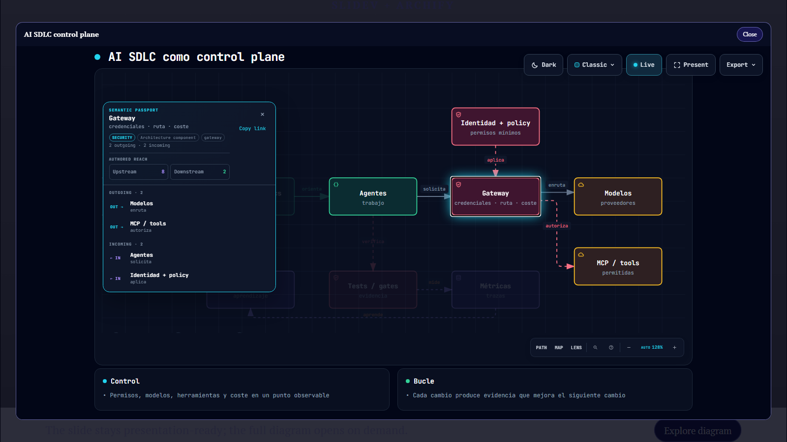

# Slidev Archify Explorer

**Make an Archify diagram a clickable, print-safe preview in Slidev.** Authors provide the static SVG and interactive HTML once; the preview itself opens the full Archify viewer in a dialog.

[](https://github.com/svg153/slidev-archify-explorer/actions/workflows/ci.yml)
[](https://github.com/svg153/slidev-archify-explorer/releases)
[](LICENSE)



## What it does

`ArchifyExplorer.vue` renders the static SVG with a visible **Explore diagram** affordance. Clicking anywhere on the preview opens a native dialog containing Archify's standalone HTML viewer, so viewers can focus nodes, follow relationships, search, and use the Archify controls without leaving the presentation.

- Works with Archify standalone HTML files; the HTML carries its viewer with it.
- Respects Slidev's configured base path.
- Uses a keyboard-operable native button and `<dialog>`, with an accessible preview, labelled dialog, and titled iframe.
- Keeps the static preview in Slidev PDF/print mode and omits the interactive controls.
- Supports a default preview prop and a slot for custom preview/layout content.
- Button and close labels can be localized.

## Try the demo

```sh
npm ci
npm run dev
```

Slidev opens the one-slide example at `http://localhost:3030`. Click **Explore diagram**, then select a node in the Archify view.

The demo pairs `public/diagrams/ai-sdlc-control-plane.svg` (static slide/PDF image) with `public/diagrams/ai-sdlc-control-plane.html` (interactive viewer). Its editable Archify source is in `diagrams/`.

## Use it in your deck

Install the addon from this GitHub repository:

```sh
npm install --save-dev github:svg153/slidev-archify-explorer
```

Declare the addon in the deck frontmatter:

```yaml
addons:
  - slidev-addon-archify-explorer
```

Put the standalone Archify HTML and SVG under `public/`, then use one component:

```md
<ArchifyExplorer
  preview="diagrams/system.svg"
  src="diagrams/system.html"
  title="System architecture"
  alt="System architecture diagram"
  button-label="Explore diagram"
  close-label="Close"
/>
```

`preview` and `src` are paths under `public/`, not remote URLs. Slidev's base URL is prepended automatically. Clicking anywhere on the SVG opens the explorer; the badge remains visible to communicate that behavior. The default labels are English; pass `button-label` and `close-label` to localize them.

For a custom preview or layout, provide slot content instead of `preview`; the slot is preserved in print mode:

```md
<ArchifyExplorer src="diagrams/system.html" title="System architecture">
  <div class="custom-preview">...</div>
</ArchifyExplorer>
```

## Commands

| Command | Description |
| --- | --- |
| `npm run dev` | Start the addon demo presentation |
| `npm run build` | Build the demo deck |
| `npm run export` | Export the demo deck to PDF |

Requires Node.js 22.

## Contributing

Issues and pull requests are welcome. Use [Conventional Commits](https://www.conventionalcommits.org/) for commit messages and PR titles, for example `feat: support custom button labels`. See [CONTRIBUTING.md](CONTRIBUTING.md), [SECURITY.md](SECURITY.md), and [CODE_OF_CONDUCT.md](CODE_OF_CONDUCT.md).

Release tags and GitHub releases are generated from Conventional Commits with [semantic-release](https://github.com/semantic-release/semantic-release). The package is currently consumed directly from GitHub rather than published to npm.

## License

The component and demo source are MIT-licensed; see [LICENSE](LICENSE). The included standalone diagram embeds Archify and third-party viewer code. See [THIRD_PARTY_NOTICES.md](THIRD_PARTY_NOTICES.md) and [ARCHIFY-LICENSE](ARCHIFY-LICENSE).
